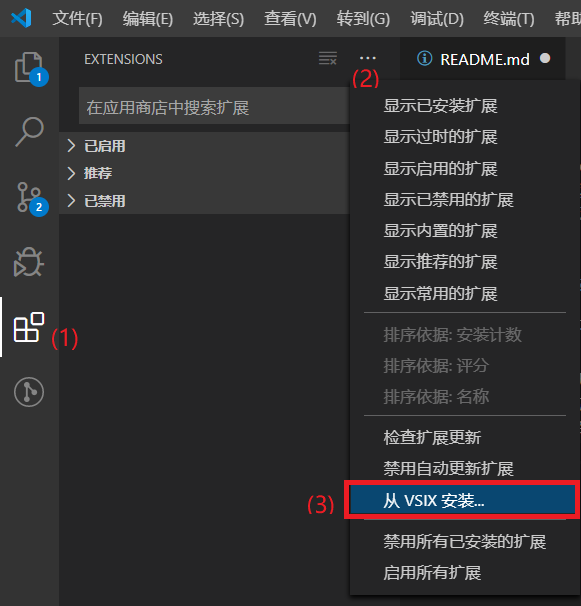
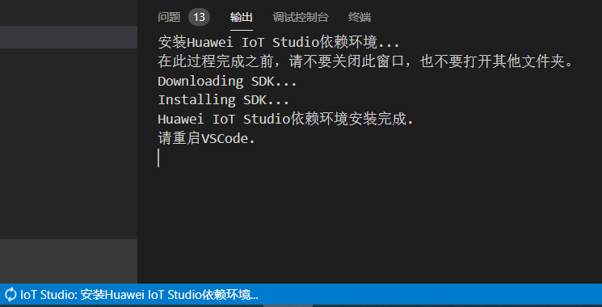

- [介绍](#%e4%bb%8b%e7%bb%8d)
- [安装](#%e5%ae%89%e8%a3%85)
  - [下载并安装 Visual Studio Code](#%e4%b8%8b%e8%bd%bd%e5%b9%b6%e5%ae%89%e8%a3%85-visual-studio-code)
  - [安装 IoT Studio 插件](#%e5%ae%89%e8%a3%85-iot-studio-%e6%8f%92%e4%bb%b6)
- [首次使用](#%e9%a6%96%e6%ac%a1%e4%bd%bf%e7%94%a8)
  - [自动下载依赖](#%e8%87%aa%e5%8a%a8%e4%b8%8b%e8%bd%bd%e4%be%9d%e8%b5%96)
  - [手动配置](#%e6%89%8b%e5%8a%a8%e9%85%8d%e7%bd%ae)
# 介绍
IoT Studio是针对LiteOS操作系统的嵌入式开发环境，提供了编译、烧录及调试等一站式开发体验，支持 C、 C++、汇编等多种开发语言，让您快速，高效地进行物联网开发。

# 安装
## 下载并安装 Visual Studio Code
从 https://code.visualstudio.com/ 下载并安装
## 安装 IoT Studio 插件

* 从应用商店安装
  - 暂未开放
* 从本地安装
  1. 打开VSCode，选择插件栏
  2. 点击EXTENSIONS后面的...按钮
  3. 点击从VSIX安装
  4. 选择对应的iot-studio.vsix即可
  
  

# 首次使用
## 自动下载依赖
IoT Studio 首次启动时会自动从网络下载最新的SDK包以及gcc依赖环境，请确保您的网络可用。  
安装过程中请不要关闭窗口，耐心等待。

## 手动配置
您也可以通过手动配置需要的依赖环境。  
1. 点击VSCode底部的Home按钮
  
2. 在弹出的界面中点击'IoT Studio'设置
3. 切换到'工具链'页签，在此可修改gcc和jlink目录
  