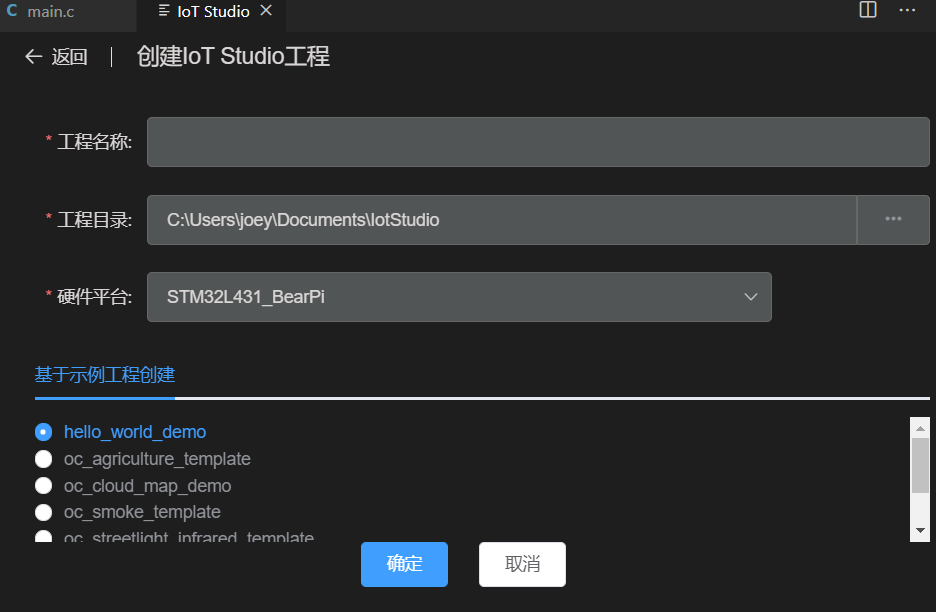

# 工程管理

## 创建工程
1. 点击VSCode底部工具栏的‘Home’按钮  

2. 在弹出界面中点击‘创建IoT Studio工程’

3. 输入工程名称，工程目录，并选择开发板的硬件平台
4. 在下拉列表中选择示例工程模板
5. 点击‘确定’，创建完成。

## 导入工程
1. 点击VSCode底部工具栏的‘Home’按钮  

2. 在弹出界面中点击‘导入GCC工程’

3. 选择工程目录
4. 系统会自动搜索目录下的makefile文件，您可以下拉选择正确的makefile
5. 选择开发板的硬件平台，系统会根据硬件平台生成默认配置
6. 点击‘确定’，导入完成。

## 编译
1. 点击VSCode底部工具栏的‘Compile’按钮  

2. 等待系统编译完成
### 编译相关配置
打开‘IoT Studio设置’--‘工程设置’--‘编译器’
  
* 您可以选择自定义的编译器路径，默认的${system_default}将使用‘IoT Studio设置’--‘用户设置’--‘工具链’配置的GCC工具目录。
* 编译使用的Makefile和Make参数可在此配置

## 烧录
1. 将开发板用数据线与电脑连接（视需要安装对应开发板的硬件驱动）
2. 点击VSCode底部工具栏的‘Download’按钮  

3. 等待系统烧录完成

### 烧录相关配置
打开‘IoT Studio设置’--‘工程设置’--‘调试器’
* OpenOCD方式
   
  * OpenOCD路径一般使用默认，特殊的开发板（如RISC-V）需要修改
  * OpenOCD参数需根据开发板配置，一般指定接口类型和硬件targets（默认已根据创建工程时的硬件平台配置好，无需修改）

* JLink方式
   
  * JLink驱动需要单独[下载安装](https://www.segger.com/downloads/jlink/JLink_Windows.exe)
  * 安装完成后在‘IoT Studio设置’--‘用户设置’--‘工具链’中指定JLink目录
  * JLink调试器需指定接口类型和设备名称，支持的设备名称列表可在此处查询： https://www.segger.com/downloads/supported-devices.php

* 调试文件  
  * 调试文件默认会在编译后自动搜索编译目录的elf文件并自动设置。
  * 您也可以点击文本框后面的搜索按钮手动触发搜索。
  * 若识别的文件不是希望的调试文件，可以手动修改。