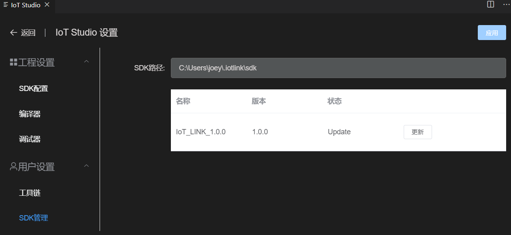

# 配置管理

## SDK配置
打开‘IoT Studio设置’--‘工程设置’--‘SDK配置’

* 可以对SDK的相关功能开启关闭，或者选择功能类型。
* 修改后点击‘应用’按钮，会在工程根目录生成.config文件和autoconf.h文件。您可以在源码或者Makefile中引用这些配置。
* SDK配置底层实际是Linux的[Kconfig](https://www.kernel.org/doc/html/latest/kbuild/kconfig-language.html)，依赖工程根目录的Kconfig文件。

## SDK管理
打开‘IoT Studio设置’--‘用户设置’--‘SDK管理’

* SDK管理功能会自动检测当前服务器上的最新版本
* 当有版本更新时请点击‘更新’按钮下载安装