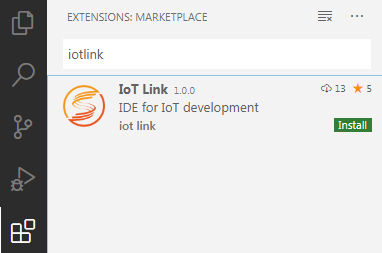
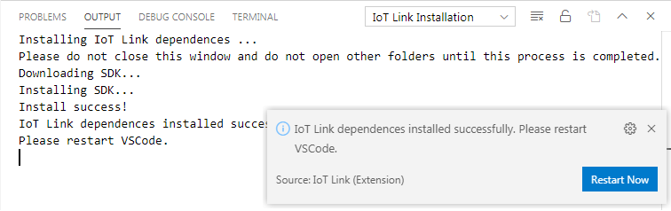
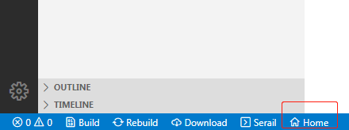
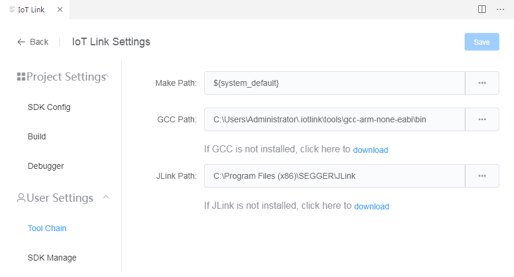

# Install
## Download and install Visual Studio Code
Download and install Visual Studio Code from https://code.visualstudio.com/

## Install IoT Link Studio plugin

* Install from the marketplace  
  * Open the VSCode Externsions marketplace, search 'iotlink' to find IoT Link Studio, then click install
  

## First Configuration
### Automatic download dependencies
When IoT Link Studio starts for the first time, it will automatically download the latest SDK package and gcc dependent environment from the network. Please ensure that your network is available.
Please do not close the window during the installation process and wait patiently. After the installation is complete, restart VSCode for the plugin to take effect.

> If you need to configure a proxy for your network, please set Proxy in VSCode Preferences - Settings - Http: Proxy, and enable proxy support for extensions.  
> If you still cannot access the network and the automatic download fails, you can download the SDK from  [here](https://developer.obs.cn-north-4.myhuaweicloud.com/idea/sdk/IoT_LINK.zip). Then unzip it to C:\Users\USER-NAME\\.Iotlink\sdk

### Manual configuration (optional)
You can also manually configure the required dependent environment.
1. Click the Home button at the bottom of VSCode

2. Click 'IoT Link Settings' in the pop-up interface
3. Switch to the 'Toolchain' tab, where you can modify the GCC and JLink directories that IoT Link Studio depends on
