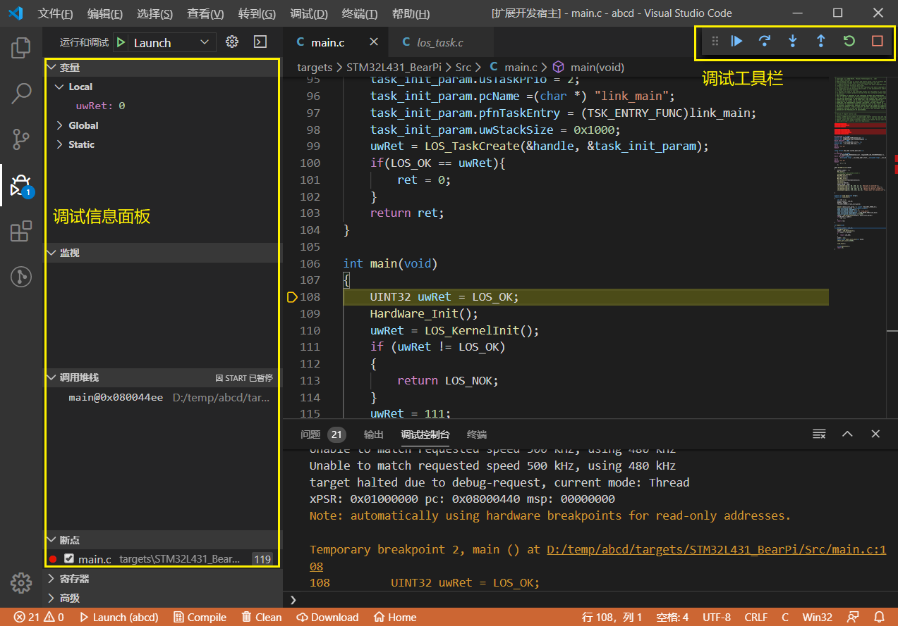
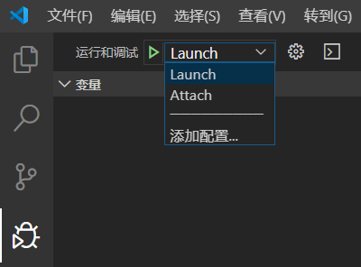
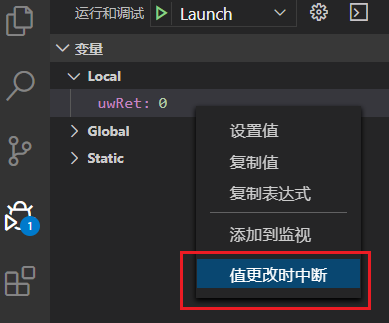
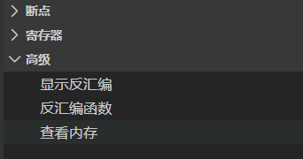
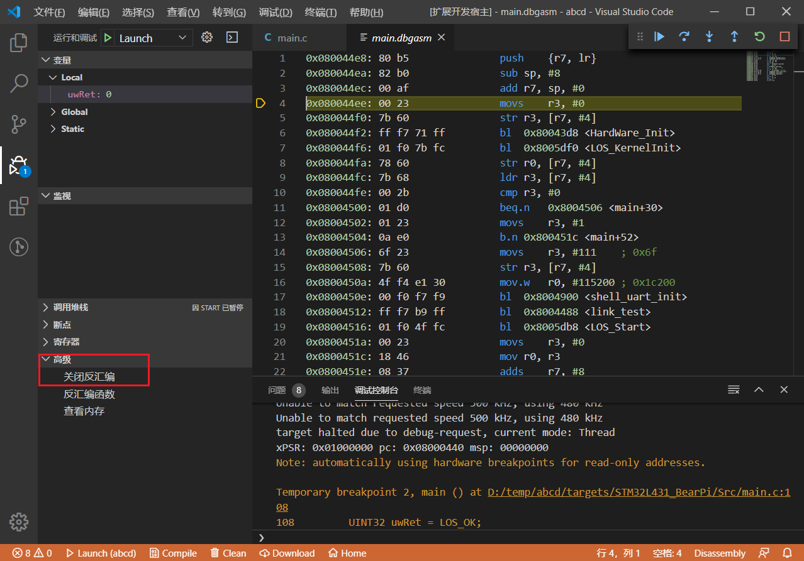

# 工程调试
IoT Link Studio 默认工程已配置好调试参数，键盘按F5键即可启动调试。
> 调试前请确保工程已正确[编译](project.md#编译)和[烧录](project.md#烧录)到开发板

## 调试模式
IoT Link Studio 支持Launch和Attach两种调试模式:
* **Launch模式** 会自动重启开发板，并停止在main函数
* **Attach模式** 不会重启开发板，停止在当前运行代码行

用户可以在调试面板进行选择，也可以通过‘添加配置’进行其他自定义配置。  
   

## 调试配置
打开‘IoT Link 设置’--‘工程设置’--‘调试器’  
具体配置请参考[烧录](./project.md#烧录)部分。

## 调试进阶
### 条件断点
1. 在代码行号处右键，点击‘添加条件断点’。  
   
2. 在弹出界面中，选择‘表达式’，并输入您需要的中断条件。  
   

### 监视点
1. 在调试面板-变量区域，右键指定需要监视的变量，选择‘值更改时中断’添加监视点，程序将在变量值修改时自动暂停。  
   
2. 您可以在调试面板-断点区域查看和管理添加的监视点。  
   

### 寄存器
1. 在调试面板-寄存器区域，可查看当前寄存器的值。
2. 右键可复制或修改选定寄存器值。  
   

### 反汇编
1. 在调试面板-高级区域，点击‘显示反汇编’，可以切换为反汇编调试模式。  
   
2. 此时代码区域将自动切换为反汇编，单步跳过\跳入\跳出将只执行一条汇编语句。您可以通过左侧的‘关闭反汇编’切换回原模式。  
   
3. 在调试面板-高级区域，点击‘反汇编函数’，输入函数名称，可以查看对应函数的反汇编代码。  

### 查看内存
1. 在调试面板-高级区域，点击‘查看内存’。  
   
2. 输入对应内存起始地址及长度，可以实时查看开发板的内存信息。  
   