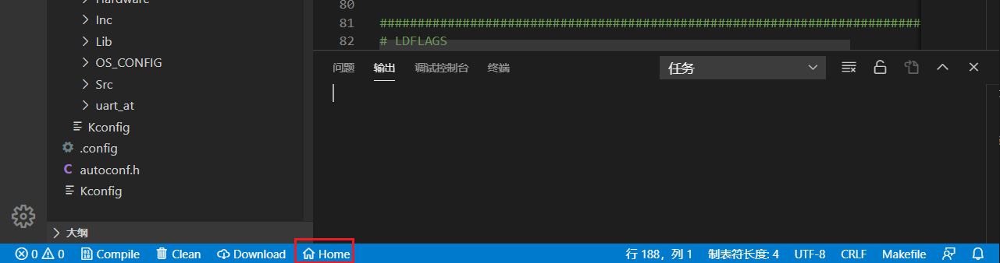

# 安装
## 下载并安装 Visual Studio Code
从 https://code.visualstudio.com/ 下载并安装Visual Studio Code
## 安装 IoT Link Studio 插件

* 方式一：从应用商店安装（推荐）
  * 打开VSCode 插件应用商店，搜索 iotlink 找到IoT Link Studio，然后点击安装  
  
* 方式二：从本地安装
  1. 打开VSCode，选择插件栏
  2. 点击EXTENSIONS后面的...按钮
  3. 在弹出菜单中选择‘从VSIX安装’
  4. 选择对应的iot-studio.vsix文件完成安装
  
  

## 首次启动配置
### 自动下载依赖
IoT Link Studio 首次启动时会自动从网络下载最新的SDK包以及gcc依赖环境，请确保您的网络可用。  
安装过程中请不要关闭窗口，耐心等待。安装完成后重启VSCode使插件生效。  

> 若您的网络需要配置代理，请在VSCode 首选项-设置-代理服务器中设置Proxy，并且开启‘对扩展使用代理’。  
> 如果仍然无法访问网络导致自动下载SDK失败，可从此处[手动下载](https://developer.obs.cn-north-4.myhuaweicloud.com/idea/sdk/IoT_LINK.zip)SDK，下载完成后解压至 C:\Users\用户名\\.iotlink\sdk

### 手动配置
您也可以手动配置需要的依赖环境。  
1. 点击VSCode底部的Home按钮  

2. 在弹出的界面中点击'IoT Link 设置'
3. 切换到'工具链'页签，在此可修改IoT Link Studio依赖的GCC和JLink目录  
