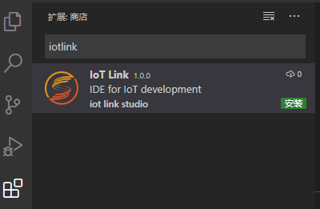
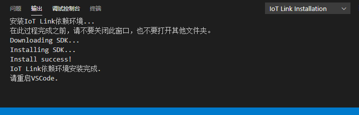
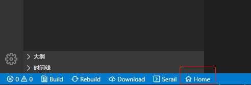
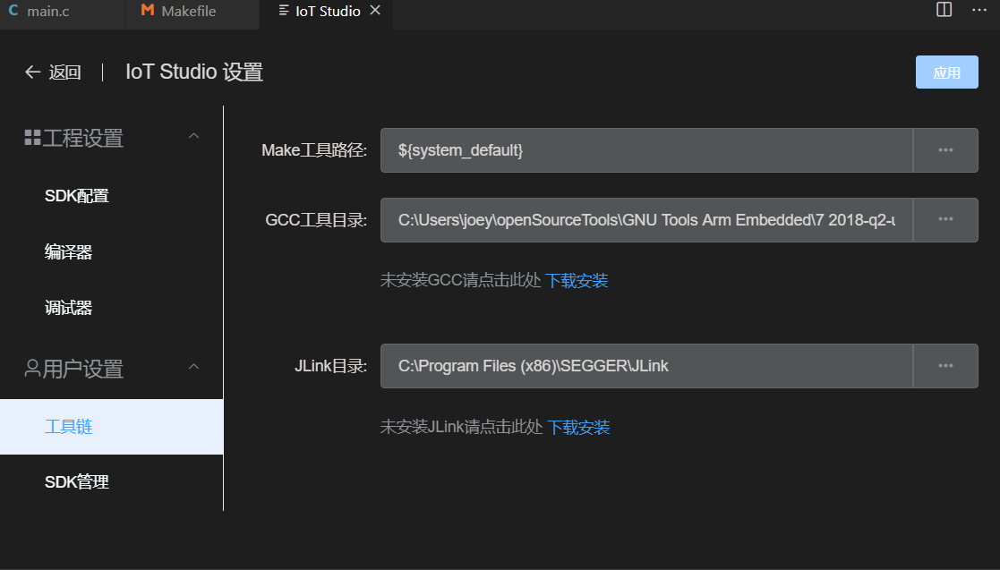

# 安装
## 下载并安装 Visual Studio Code
从 https://code.visualstudio.com/ 下载并安装Visual Studio Code  
**注意：当前仅支持Windows版VSCode，Linux、Mac 暂不支持!!!**

## 安装 IoT Link Studio 插件

* 方式一：从应用商店安装（推荐）
  * 打开VSCode 插件应用商店，搜索 iotlink 找到IoT Link Studio，然后点击安装  
  
* 方式二：从本地安装
  1. 打开VSCode，选择插件栏
  2. 点击EXTENSIONS后面的...按钮
  3. 在弹出菜单中选择‘从VSIX安装’
  4. 选择对应的iot-studio.vsix文件完成安装
  
  

## 首次启动配置
### 自动下载依赖
IoT Link Studio 首次启动时会自动从网络下载最新的SDK包以及gcc依赖环境，请确保您的网络可用。  
安装过程中请不要关闭窗口，耐心等待。安装完成后重启VSCode使插件生效。  

> 若您的网络需要配置代理，请在VSCode 首选项-设置-代理服务器中设置Proxy，并且开启‘对扩展使用代理’。  
> 如果仍然无法访问网络导致自动下载SDK失败，可从此处[手动下载](https://developer.obs.cn-north-4.myhuaweicloud.com/idea/sdk/IoT_LINK.zip)SDK，下载完成后解压至 C:\Users\用户名\\.iotlink\sdk

### 手动配置(可选)
如果自动下载依赖没有成功，可以手动配置需要的依赖环境。  
1. 点击VSCode底部的Home按钮  

2. 在弹出的界面中点击'IoT Link 设置'
3. 切换到'工具链'页签，在此可修改IoT Link Studio依赖的GCC和JLink目录(非必须)  

4. 若此处的GCC没有自动配置成功，需要用户手动选择GCC目录，一般为 C:\Program Files (x86)\GNU Tools Arm Embedded\9 2019-q4-major\bin
5. 如果本地没有安装GCC，需要点击提示里的‘下载安装’链接，在弹出页面中选择正确的gcc版本下载安装。

## FAQ

* Q: 安装完插件后底部没有Home按钮?  
  A: 常见的原因是您使用了Linux/Mac版的VSCode，目前插件还不支持。

* Q: 新建的工程编译失败?  
  A: 检查'用户设置'--'工具链'里的GCC工具目录是否配置正确，如果插件自动下载安装的GCC，路径为C:\Users\用户名\\.iotlink\tools\gcc-arm-none-eabi\bin。若此处没有配置，则需要点击提示里的链接下载安装GCC，安装完成后填写GCC目录，一般为 C:\Program Files (x86)\GNU Tools Arm Embedded\9 2019-q4-major\bin  

* Q: 工程烧录失败?  
  A: 失败可能的原因较多，可以做如下的尝试：  
     1. 检查开发板和电脑是否正确连接
     2. 重新插拔USB线
     3. 检查工程设置--'调试器'中的Adapter是否配置正确，OpenOCD类型的注意检查参数，JLink类型的检查设备名称是否和开发板匹配
     4. 尝试重新安装STLink驱动

* Q: VSCode提示检测到#include错误，请更新includePath?  
  A: 该错误为VSCode找不到gcc编译器的头文件，但并不影响实际的编译功能。如果想修复可打开当前工程的.vscode/c_cpp_properties.json，检查配置的includePath是否正确。一个参考的配置如下：
  ```json
  "includePath": 
  [
    "C:/Program Files (x86)/GNU Tools Arm Embedded/9 2019-q4-major/arm-none-eabi/include",
    "C:/Program Files (x86)/GNU Tools Arm Embedded/9 2019-q4-major/lib/gcc/arm-none-eabi/9.2.1/include",
    "${workspaceFolder}/**",
    "${sdkPath}/**"
  ],
  ```